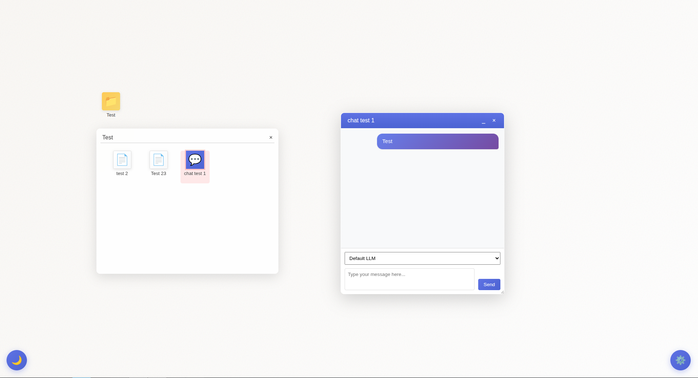

# PromptDesk

A minimalist **AI-powered desktop** that runs entirely in your browser.

Create notes, folders, and chat windows connected to **OpenAI**, **Claude**, or **Gemini** — all saved locally, with no backend (currently) required.

> “Your personal thinking space — where every idea becomes a file.”



## 🧩 Architecture Overview

PromptDesk uses a **single-page HTML + JS + CSS** architecture:

- `index.html` — main entry point, loads the desktop and modal UI.  
- `app.js` — handles all logic (file system, chat UI, API calls, persistence).  
- `styles.css` — minimal styling for draggable windows and modals.  

All files and settings are stored in `localStorage` under the `promptdesk_data` key.

## 🧭 Usage

1. **Clone the repo:**
   ```bash
   git clone https://github.com/EdwardAThomson/PromptDesk.git
   cd PromptDesk

2. Open in browser:
   - Just double-click index.html or serve locally: 

    ```bash
    python -m http.server 8000
    ```

   - Visit `http://localhost:8000` in your browser.

3. Set your API keys:

    - Click the ⚙️ (config) icon in the bottom-right.

    - Paste your OpenAI, Claude, or Gemini key.

    - Select your default model.

4. Start creating:

    - Right-click → “Create New File” or “Create Folder.”

    - Double-click a file to edit, or right-click to “Send to GPT/Claude/Gemini.”

   